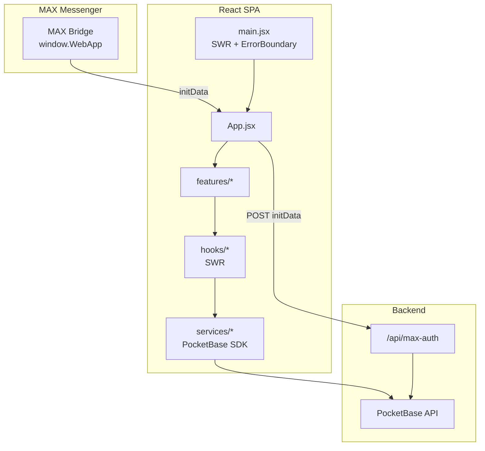
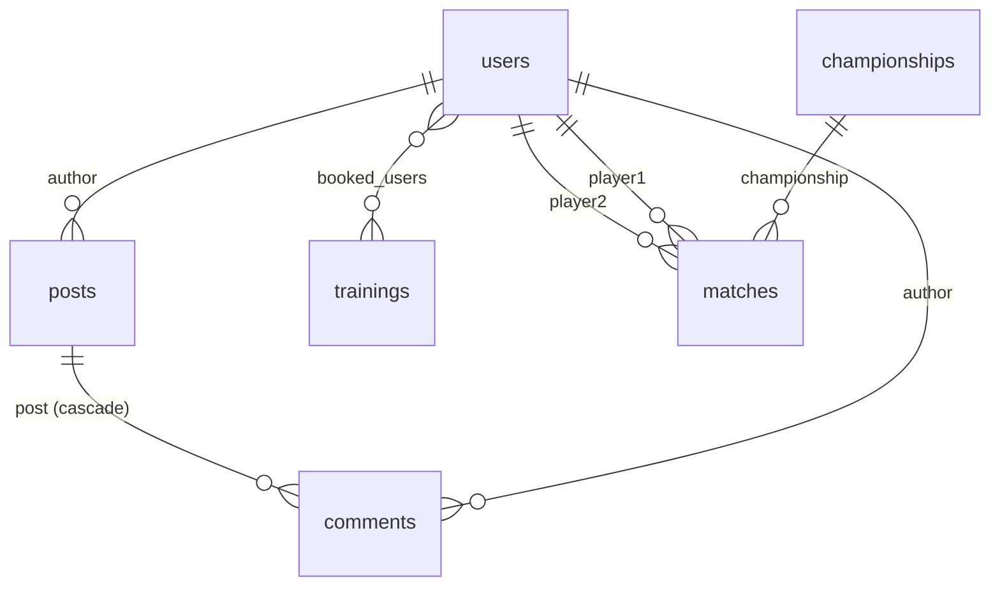

# Секция Миленьких — Mini App для MAX

Мобильное SPA для участников секции настольного тенниса. Приложение работает внутри webview мессенджера [MAX](https://max.ru) через [MAX Bridge](https://dev.max.ru/docs/webapps/bridge), хранит данные в [PocketBase](https://pocketbase.io/) и оптимизировано под touch-интерфейс и жесты на 60 FPS.

## Возможности

| Раздел | Описание |
|--------|----------|
| **Лента** | Посты с медиа, комментарии, soft-delete, pinch-to-zoom и swipe-to-close для фото |
| **Тренировки** | 14-дневный календарь, запись на занятия, лимит мест, типы «групповая» / «турнир» |
| **Магазин** | Каталог экипировки с карточками товаров и формами для модератора |
| **Рейтинг** | Таблица игроков с очками и статистикой И/П/П |
| **Соревнования** | Чемпионаты, матчи, ввод результатов с пересчётом рейтинга |
| **Галерея** | Фотоальбом секции с полноэкранным просмотром |
| **Профиль** | Данные игрока, статистика, список записанных тренировок |

Дополнительно:

- Авторизация через `window.WebApp.initData` с серверной валидацией (`/api/max-auth`)
- Роли `user` / `moderator` (модератор создаёт контент и управляет расписанием)
- Мягкое удаление постов и комментариев с физической зачисткой при смене вкладки или закрытии webview

## Стек

| Слой | Технологии |
|------|------------|
| Frontend | React 18, Vite 5, JavaScript (JSX), SWR, date-fns |
| UI | Собственные компоненты (`Modal`, `AlertDialog`, `Avatar`), CSS-модули по фичам |
| Backend | PocketBase 0.21+ (Go, embedded SQLite) |
| Платформа | MAX Bridge (`max-web-app.js`), Nginx reverse proxy, SSL |

## Быстрый старт

### Требования

- Node.js 18+
- npm 9+
- Запущенный экземпляр PocketBase с коллекциями из [`schema.json`](schema.json)

### Установка и запуск

```bash
cd client
npm install
cp ../config/env_app.conf .env   # или создайте .env вручную (см. ниже)
npm run dev
```

Приложение откроется на `http://localhost:3000`. Вне MAX Bridge сессия берётся из `localStorage` (PocketBase `authStore`), если пользователь уже логинился.

### Production-сборка

```bash
cd client
npm run build
```

Артефакты — в `client/dist/`. Vite настроен с `base: '/tt-api/'` (см. [`client/vite.config.js`](client/vite.config.js)).

## Переменные окружения

Создайте `client/.env` (пример — [`config/env_app.conf`](config/env_app.conf)):

| Переменная | Назначение |
|------------|------------|
| `VITE_POCKETBASE_URL` | Базовый URL PocketBase (без `/api`), например `https://example.com/tt` |
| `VITE_MAX_AUTH_URL` | Endpoint авторизации MAX, например `${PB_URL}/api/max-auth` |
| `VITE_MAX_APP_ID` | ID мини-приложения из кабинета разработчика MAX |
| `VITE_API_URL` | Публичный URL статики (опционально, для ссылок) |

> [!IMPORTANT]
> Не коммитьте `.env` с production-секретами. Для локальной разработки достаточно копии `config/env_app.conf`.

## Структура репозитория

```
tennis/
├── client/                 # Frontend (Vite + React)
│   ├── src/
│   │   ├── App.jsx         # Shell: табы, flush soft-delete, маршрутизация по activeTab
│   │   ├── main.jsx        # SWRConfig, ErrorBoundary, AlertDialogProvider
│   │   ├── config.js       # PB_URL, MAX_AUTH_URL, MEDIA_BASE_URL
│   │   ├── components/     # AppHeader, BottomNav, ui/*
│   │   ├── features/       # feed, trainings, shop, rating, competitions, gallery, profile
│   │   ├── hooks/          # useMaxAuth, usePosts, useTrainings, …
│   │   ├── services/       # pb, auth, posts, trainings, catalog
│   │   └── lib/            # format, media, avatar, gestures, log
│   ├── index.html          # Подключение MAX Bridge SDK
│   └── vite.config.js
├── config/                 # nginx, env-шаблоны для деплоя
├── schema.json             # Схема коллекций PocketBase
└── AUDIT.md                # Отчёт по аудиту производительности и a11y
```

## Архитектура клиента



- **Данные:** SWR-кэш с `dedupingInterval: 5000`, без revalidate on focus (удобно для webview).
- **Авторизация:** [`useMaxAuth`](client/src/hooks/useMaxAuth.js) — идемпотентный init, `AbortController`, параллельная зачистка «зомби»-комментариев.
- **Модалки:** единый [`Modal`](client/src/components/ui/Modal.jsx) с focus-trap, ESC и `aria-modal`.
- **Диалоги:** [`useAlertDialog`](client/src/components/ui/AlertDialog.jsx) вместо `window.alert` / `confirm`.

## Интеграция с MAX

1. В [`client/index.html`](client/index.html) подключается SDK:
   ```html
   <script src="https://st.max.ru/js/max-web-app.js"></script>
   ```
2. При старте читается `window.WebApp.initData` и отправляется на `MAX_AUTH_URL`.
3. Сервер валидирует подпись (см. [документацию MAX](https://dev.max.ru/docs/webapps/validation)) и возвращает токен PocketBase.
4. При закрытии webview (`pagehide` / `visibilitychange`) приложение дочищает мягко удалённые посты и комментарии.

> [!NOTE]
> Для полноценной работы авторизации мини-приложение должно открываться из MAX, а не напрямую в браузере.

## Деплой (Nginx)

Типовая схема (подробнее — [`config/nginx_app.conf`](config/nginx_app.conf)):

| Путь | Назначение |
|------|------------|
| `/tt-api/` | Статика из `client/dist/` (`try_files` → `index.html` для SPA) |
| `/tt/api/` | Proxy на PocketBase (`/api/`) |

Пример фрагмента:

```nginx
location /tt-api/ {
    alias /path/to/tennis/client/dist/;
    try_files $uri $uri/ /tt-api/index.html;
}

location /tt/api/ {
    proxy_pass http://pocketbase_tt/api/;
    proxy_http_version 1.1;
    proxy_set_header Host $host;
    proxy_set_header X-Real-IP $remote_addr;
    proxy_set_header X-Forwarded-For $proxy_add_x_forwarded_for;
    proxy_set_header X-Forwarded-Proto $scheme;
}
```

Для загрузки крупных медиа в ленте настройте `client_max_body_size` (в проекте использовалось до 50M).

## Схема данных (PocketBase)

Полный экспорт коллекций — в [`schema.json`](schema.json). Импортируйте его в админке PocketBase перед первым запуском клиента.

### Обзор коллекций

| Коллекция | Тип | Назначение в приложении |
|-----------|-----|-------------------------|
| `users` | auth | Игроки: профиль, рейтинг, роль, привязка к MAX (`max_id`) |
| `posts` | base | Лента новостей, медиа, soft-delete (`is_deleted`) |
| `comments` | base | Комментарии к постам, soft-delete |
| `trainings` | base | Расписание, запись участников, лимит мест |
| `products` | base | Магазин экипировки |
| `championships` | base | Турнирные серии (`is_active`) |
| `matches` | base | Матчи внутри чемпионата, счёт и статус |
| `gallery` | base | Фотоальбом секции |

### Связи между сущностями



- Удаление поста каскадно удаляет связанные комментарии (`comments.post`, `cascadeDelete: true`).
- Игроки в матчах и авторы контента — записи из `users`.
- Запись на тренировку — массив ID в `trainings.booked_users` (до 999 участников).

### `users` (auth)

| Поле | Тип | Описание |
|------|-----|----------|
| `email`, `password` | системные | Вход в PocketBase (парольный auth по email) |
| `full_name` | text | Отображаемое имя в UI |
| `name` | text | Доп. имя (legacy / OAuth-маппинг) |
| `max_id` | text | Идентификатор пользователя в MAX (уникальная привязка) |
| `avatar` | file | Локальный файл аватара (jpeg, png, webp, …) |
| `avatar_url` | text | Внешний URL аватара (из MAX Bridge) |
| `age` | number | Возраст (профиль) |
| `birth_year` | number | Год рождения (рейтинг / формы) |
| `hand` | select | `Правая` \| `Левая` |
| `dominant_hand` | text | Ведущая рука в профиле (`Правая`, `Левая`, `Амбидекстр`) |
| `rating_points` | number | Рейтинговые очки |
| `games_count`, `wins`, `losses` | number | Статистика матчей |
| `role` | select | `user` \| `moderator` |

Токен сессии PocketBase живёт **7 суток** (`authToken.duration: 604800`).

### `posts` и `comments`

**posts**

| Поле | Тип | Примечание |
|------|-----|------------|
| `content` | text | Текст публикации |
| `media` | file (≤5) | Изображения / видео поста |
| `author` | relation → `users` | Автор |
| `is_deleted` | bool | Мягкое удаление (скрытие в ленте) |

**comments**

| Поле | Тип | Примечание |
|------|-----|------------|
| `text` | text | Текст комментария |
| `post` | relation → `posts` | Привязка к посту |
| `author` | relation → `users` | Автор |
| `is_deleted` | bool | Мягкое удаление |

Клиент дополнительно хранит ID «ожидающих» удаления комментариев в `sessionStorage` (`pending_delete_comments`) до flush при смене вкладки или закрытии webview.

### `trainings`

| Поле | Тип | Примечание |
|------|-----|------------|
| `date` | date | Дата и время начала (ISO) |
| `duration` | number | Длительность, минуты |
| `type` | select | `group` — групповая, `tournament` — турнир |
| `max_slots` | number | Лимит мест (`null` — без лимита) |
| `location` | text | Адрес площадки |
| `description` | text | Описание для карточки |
| `booked_users` | relation → `users` | Записавшиеся игроки |

### `products` и `gallery`

**products:** `title`, `description`, `price`, `sizes`, `images` (до 5 файлов).

**gallery:** одно поле `image` (file) на запись.

### `championships` и `matches`

**championships:** `name`, `is_active` (фильтр активных серий в UI).

**matches**

| Поле | Тип | Значения / связи |
|------|-----|------------------|
| `championship` | relation → `championships` | Турнир |
| `player1`, `player2` | relation → `users` | Участники |
| `date_time` | date | Дата и время матча |
| `status` | select | `scheduled`, `finished`, `cancelled` |
| `score_p1`, `score_p2` | number | Счёт |
| `sets` | text | Детализация сетов, напр. `11:5, 5:11, 11:2` |

При `status = finished` серверная логика обновляет `rating_points`, `wins`, `losses` у обоих игроков.

### Правила API (из экспорта)

Для коллекций `products`, `posts`, `matches`, `gallery`, `championships` в `schema.json` задано:

- **create / update / delete:** `@request.auth.id != ""` — только авторизованные пользователи.

У `users`, `trainings`, `comments` в экспорте правила пустые — при деплое проверьте политики в админке PocketBase.

> [!TIP]
> После изменения схемы обновите [`schema.json`](schema.json) экспортом из PocketBase и пересоберите клиент, если менялись имена полей или связей.

## Разработка

| Команда | Действие |
|---------|----------|
| `npm run dev` | Dev-сервер Vite (порт 3000) |
| `npm run build` | Production-бандл в `dist/` |
| `npm run preview` | Локальный просмотр production-сборки |

Полезные ссылки:

- [MAX Bridge API](https://dev.max.ru/docs/webapps/bridge)
- [PocketBase JS SDK](https://pocketbase.io/docs/api-records/)
- Внутренний аудит: [`AUDIT.md`](AUDIT.md)
